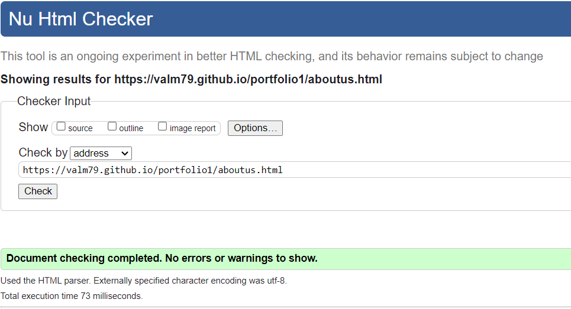

#Flowers Shop
---
Flower shop is a website for a flower shop based in Dublin City Center it allows users to find information on the shop, order flowers and visit the social media pages of the shop.

 

## Features

### Site wide

- Navigation Menu 
    - Contains links to the home page, order and about us page
    - Allows users to easily navigate 

    

- Footer
    - This section contains link icons to the social media pages of the flower shop 
    - It also contains the address and phoe number of the flower shop

    

- Favicon
    - A site wide favicon of a sunflower was implemented.
    - This will allow users to easily navigate to the page if they have multiple tabs open.

## Landing Page
- Hero Image  
    - This section contains an image of one of the staff working and an overlay text of the name of the shop and the logo
    - This will show the user what the website is about and brings some life to the page

- Hero Text
    - This gives the name of the flower shop giving the site more context

## Order Page 

- Order Form
    - This section contains a form that will collect users personal information and also what quantity of flowers they would like.

- On successful submission of the order form, the user will be navigated to submit.html displaying a success message and home button.

## About Us Page

- About us page will provide the user with general information of the shop and services providen.

