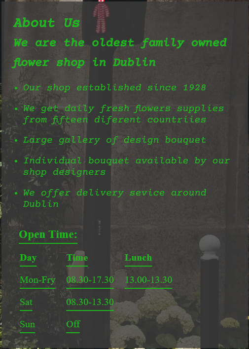

# Flowers Shop
---
Flower shop is a website for a flower shop based in Dublin City Center it allows users to find information on the shop, order flowers and visit the social media pages of the shop.

A link to the website can be found [Here](https://github.com/ValM79/portfolio1/deployments/activity_log?environment=github-pages)

 

## Features

### Site wide

- Navigation Menu 
    - Contains links to the home page, order and about us page.
    - Allows users to easily navigate. 
      - Positioned at the top of the page.
    - Home - brings you to the home page.
    - Order - leads to the order page.
    - About us - gives you general idea of the company.
    - Submit - submits customer order.
  - The link of the page that the user currently on is underlined.
  - The links have animated hover effect.
  - The navigation bar is responsive.

    

- Footer
    - This section contains social media link icons to the social media pages of the flower shop that open in a new tab.
    - Social media links are animated on hover.
    - It also contains the address and phoe number of the flower shop.

    

- Favicon
    - A site wide favicon of a sunflower was implemented.
    - This will allow users to easily navigate to the page if they have multiple tabs open.

### Landing Page
- Hero Image  
    - Hero section have an animated background image.
    - It's also has section showing the text block with transparent background at the right side of the screen.
    - This will show the user what the website is about and brings some life to the page.

- Hero Text
    - This gives the name of the flower shop giving the site more context

### Order Page 

- Order Form
    - This section contains a form that will collect users personal information and also what quantity of flowers they would like.

### Order Success Page

- On successful submission of the order form, the user will be navigated to submit.html displaying a success message and home button.

ADD IMAGE OF SUCCESS PAGE

### About Us Page

- About us page will provide the user with general information of the shop and services provided.

- This page also contains the opening times of the flower shop

## Existing Features

- Responsive design tested via dev tools

- Order form and success page

- About us page with opening times

## Features Left to Implement

- By implementing Javascript it would be possible for the shop owner to recieve form submission info via email

- A Google Maps API could be implemented in order to allow users to navigate to the shop

## Wireframes

## Technologies used

- HTML 
    - Used to create main structure of website
- CSS 
    - Style and design was applied using CSS
- Visual Studio Code
    - Was used as the IDE to develop the site
- GitHub
    - The source code is hosted on GitHub
- Git
    - Used to commit and push code to GitHub throughout development
- Favicon
    - [Favicon Tool](https://favicon.io/favicon-converter/) was used to create the custom favicon for the site 
- Balsamiq wireframes 
    - [Balsamiq wireframes ](https://balsamiq.com/wireframes/desktop/#) was used to create wireframe designs of the website layout during development
- Font Awesome 
    - [Font Awesome](https://fontawesome.com/) was used to implement the social media icons in the footer of the website
- Google fonts
    - [Google Fonts](https://fonts.google.com/) was used to implement custom fonts into the website

## Testing Responsiveness

All pages were tested in order to ensure responsiveness on screen sizes from 340px and upwards.
- The website was tested in different browsers such as Chrome and Firefox.
- Devtools was used and [https://responsivedesignchecker.com/](https://responsivedesignchecker.com/) to confirm that the website is responsive, looks and functions as it supposed to on all standard screen sizes.

Steps to test:

1. Open browser and follow [link](https://github.com/ValM79/portfolio1/deployments/activity_log?environment=github-pages) 

2. Open dev tools by right clicking and selecting inspect

3. Set to responsive by clicking the tablet icon and decrease and increase window size using the responsive window to check responsiveness

Expected: 

Website would be responsive on all window sizes to 340px width.

Result:

Website behaved as expected on all browsers

The Website was also opened on the following devices with no issues:

- Iphone 11 Pro
- Iphone 12 Max 
- Samsung Galaxy A 71

## Accessibility
[Wave](https://wave.webaim.org/) Accessibility tool was used to test accesibility and track any accessibility bugs throughout development and for final testing ofthe deployed website.

Testing was conducted in order to ensure:

- All formelements have aria-labels ensuring screen readers can navigate easily

- Color contrasts meet a minimum ratio 

- Heading levels are ordered properly and none are skipped to ensure that hierachy of content is maintained

- All non text content had alternative text in order to read out to screen readers

## Lighthouse Testing

- Using lighthouse in devtools I confirmed that the website is performing well, accessible and colors and fonts chosen are readable.

## Validator testing

- HTML
    - There some errors and warnings were found when passing through the official W3C validator.

  

  

- CSS
     - No errors or warnings were found when passing through the official W3C validator.

     PHOTOS

## Functional Testing

### Navigation Links

- Testing was performed to ensure all navigation links on the respective pages, navigated to the correct pages as per design.
- This was done by clicking on the navigation links on each page.
- Links on all pages navigated to the correct pages as exptected.

| Navigation Links | Page to Load |
| ----------- | ----------- |
| Home | index.html |
| order | order.html |
| About Us | aboutus.html |

## Form Testing

The form on the order page was tested to ensure it functioned as expected a number of tests were done to ensure all was working as expected. All fields gave required message when form was submitted with a field left blank. Email field required correct format.

### Footer Social Media Links

Testing was conducted to ensure all social media links linked to the correct pages. When clicked pages opened in a new tab as expected.

## Deployment
-  The website was deployed to GitHub pages and can be accessed by the link [https://github.com/ValM79/portfolio1/deployments/activity_log?environment=github-pages](https://github.com/ValM79/portfolio1/deployments/activity_log?environment=github-pages)

## Media

All images were downloaded from 